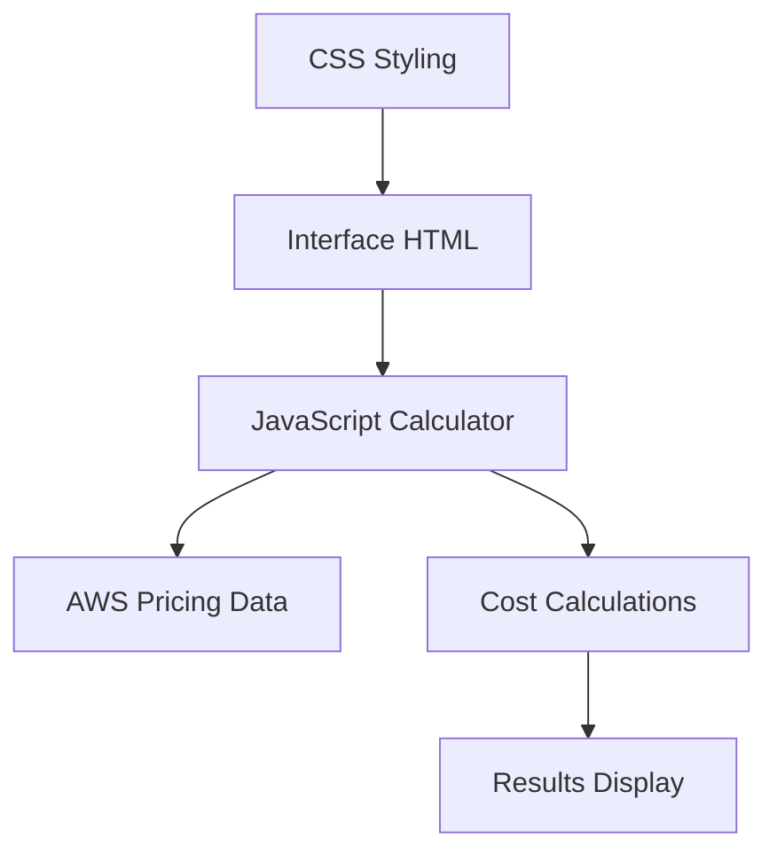

# AWS Cost Calculator 💰

## Qual problema inspirou a ideia

Muitos desenvolvedores e empresas têm dificuldade em estimar os custos dos serviços AWS antes de implementar suas soluções. A falta de uma ferramenta simples e rápida para calcular custos básicos pode levar a surpresas na fatura mensal ou decisões arquiteturais inadequadas por falta de informação sobre preços.

## Como a solução foi construída

O AWS Cost Calculator foi desenvolvido como uma aplicação web simples e funcional usando:
- **Frontend**: HTML5, CSS3 e JavaScript vanilla
- **Design**: Interface responsiva com gradientes modernos
- **Cálculos**: Baseados nos preços oficiais da AWS (região us-east-1)
- **Funcionalidades**: Calculadora interativa para EC2, S3, RDS e Lambda
- **Validação**: Inputs validados em tempo real
- **UX**: Animações suaves e design intuitivo

### Arquitetura


## Instruções para rodar

### Método 1: Abrir diretamente no navegador
```bash
# Clone o repositório
git clone https://github.com/seu-usuario/aws-cost-calculator
cd aws-cost-calculator

# Abra o index.html no seu navegador
open index.html  # macOS
start index.html # Windows
xdg-open index.html # Linux
```

### Método 2: Servidor local simples
```bash
# Python 3
python -m http.server 8000

# Python 2
python -m SimpleHTTPServer 8000

# Node.js (se tiver npx)
npx serve .

# Acesse: http://localhost:8000
```

### Como usar:
1. Preencha os campos para cada serviço AWS
2. Clique em "Calcular Custos" ou use Ctrl+Enter
3. Veja a estimativa detalhada por serviço

## Screenshot


## Próximos passos

1. **Mais serviços AWS** (CloudFront, API Gateway, DynamoDB)
2. **Múltiplas regiões** com preços específicos
3. **Calculadora de Reserved Instances** vs On-Demand
4. **Exportar estimativas** em PDF/Excel
5. **Histórico de cálculos** com localStorage
6. **Integração com AWS Pricing API** para preços em tempo real
7. **Calculadora de TCO** (Total Cost of Ownership)
8. **Comparação com outros provedores cloud**

## Lista de Prompts Utilizados com Amazon Q Developer

1. "Crie uma calculadora web simples para estimar custos da AWS"
2. "Desenvolva HTML estruturado para formulário de cálculo de custos"
3. "Implemente CSS moderno com gradientes e design responsivo"
4. "Crie JavaScript para calcular custos de EC2, S3, RDS e Lambda"
5. "Adicione validação de inputs e animações suaves"
6. "Implemente preços baseados na região us-east-1 da AWS"
7. "Crie interface intuitiva com seções organizadas por serviço"
8. "Adicione funcionalidade de scroll suave para resultados"
9. "Implemente atalhos de teclado para melhor UX"
10. "Otimize código para performance e manutenibilidade"

## Testes

### Teste manual básico:
```bash
# Abra o index.html e teste:
# 1. EC2: 1 instância t3.micro por 744 horas = ~$8.63
# 2. S3: 100GB + 10k requests = ~$2.30
# 3. Lambda: 1M requests, 200ms, 512MB = ~$0.83
# Total esperado: ~$11.76
```

### Teste automatizado:
```javascript
// Teste da função de cálculo (abra console do navegador)
// Simular inputs e verificar outputs
console.log('Testando calculadora...');
document.getElementById('ec2-instances').value = '1';
document.getElementById('ec2-hours').value = '744';
calculateCosts();
```

## Estimativa de Custo (Hospedagem)

### Hospedagem estática:
- **GitHub Pages**: Gratuito
- **Netlify**: Gratuito (até 100GB bandwidth)
- **Vercel**: Gratuito (até 100GB bandwidth)
- **AWS S3 + CloudFront**: ~$1-5/mês (dependendo do tráfego)

**Total estimado: $0-5/mês**

## Tecnologias e Referências

- [AWS Pricing](https://aws.amazon.com/pricing/) - Preços oficiais dos serviços
- [MDN Web Docs](https://developer.mozilla.org/) - Documentação HTML/CSS/JS
- [CSS Gradient Generator](https://cssgradient.io/) - Gerador de gradientes
- [Mermaid](https://mermaid-js.github.io/) - Diagramas em markdown

---

**Tags**: #q-developer-quest-tdc-2025 #aws #cost-calculator #javascript #html #css

**Desenvolvido com Amazon Q Developer para TDC 2025**